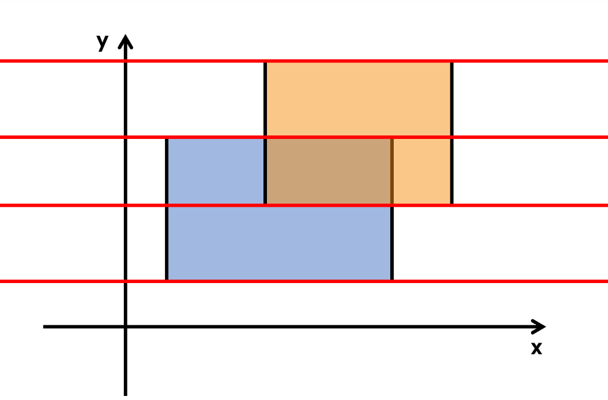

# 关于本库

欢迎访问我的计算几何算法库项目 "dynamicLibrary"。该库包含多种常用的计算几何算法，如判断点与多边形的位置关系、计算重叠矩形面积、判断线段是否相交、Delaunay 三角剖分算法以及 Graham 求凸包算法。

### 主要特性

* **点与多边形位置关系**：判断给定点是否在多边形内部、外部或边上。
* **计算重叠矩形面积**：计算两个矩形的重叠区域面积。
* **判断线段是否相交**：利用快速排斥实验和跨立实验检测两条线段是否相交。
* **Delaunay 三角剖分**：生成一组点的 Delaunay 三角剖分。
* **Graham 求凸包**：利用 Graham 扫描算法计算一组点的凸包。

### 使用方法

1. **包含头文件**：在需要使用这些算法的文件中包含相应的头文件。
2. **编译链接**：在编译时链接该算法库。

### 示例

使用算法库的示例代码在 `src` 文件夹下的 `main.cpp` 中给出。部分示例需要调用 SFML 库，使用这些测试用例之前需要安装 SFML 库。您可以执行项目根目录下的"serup"脚本程序，自动完成 SFML 库的安装、dynamicLibrary库编译以及main示例程序的编译。

使用“setup”脚本步骤：

1. 赋予脚本执行权限
2. 执行脚本

```
chmod +x setup.sh 
./setup.sh
```

### CMake 配置

项目的 CMakeLists 文件已经配置好，能够编译算法库和使用示例程序 `main.cpp`。

# 计算几何

## 几何基础

### 1.判断一点在直线的哪边

- 我们有直线上的一点 P 的直线的方向向量 v，想知道某个点 Q在直线的哪边。我们利用向量积的性质，算出 PQ 向量与 v 向量的外积。如果向量积为负，则Q在直线下方，如果向量积为 0，则 Q 在直线上，如果向量积为正，则 Q 在直线上方。

  - 公式如下：
    $$
    \vec{PQ} \times \vec{v} = (Q_x - P_x) \times v_y - (Q_y - P_y) \times v_x
    $$
- 代码实现如下：
- point_line.h文件
- ```c++
  // point_line.h

  #ifndef POINT_LINE_H
  #define POINT_LINE_H

  #include <string>
  #include <iostream>

  // 定义点
  struct Point {
      double x;
      double y;
  };

  // 定义向量
  struct Vector {
      double x;
      double y;
  };

  // 函数用于计算 PQ 向量与 v 向量的叉积
  double crossProduct(const Point& P, const Point& Q, const Vector& v);

  // 函数用于判断点 Q 相对于过点 P 的直线的位置关系
  std::string determinePosition(const Point& P, const Point& Q, const Vector& v);

  #endif // POINT_LINE_H

  ```
- point_line.cpp文件
- ```c++
  // point_line.cpp

  #include "point_line.h"

  // 函数用于计算 PQ 向量与 v 向量的叉积
  double crossProduct(const Point& P, const Point& Q, const Vector& v) {
      double pq_x = Q.x - P.x;
      double pq_y = Q.y - P.y;
      return pq_x * v.y - pq_y * v.x;
  }

  // 函数用于判断点 Q 相对于过点 P 的直线的位置关系
  std::string determinePosition(const Point& P, const Point& Q, const Vector& v) {
      double cross = crossProduct(P, Q, v);
      if (cross > 0) {
          return "Point is above the line";
      } else if (cross < 0) {
          return "Point is below the line";
      } else {
          return "Pointis on the line";
      }
  }

  ```

### 2.快速排斥实验与跨立实验

- 判断两条线段是否相交。

  - 首先考虑特殊情况
    1. 两直线平行，这种情况通过判断线段所在直线的斜率是否相等即可。
    2. 两直线重合，如果两线段重合或部分重合，只需要判断是否有三点共线的情况即可。
    3. 两直线相交
- **快速排斥实验**

  - “两直线离得太远了”，如以下两直线
  - 
  - 它们各自占的区域：
    - 
    - 规定「一条线段的区域」为以这条线段为对角线的，各边均与某一坐标轴平行的矩形所占的区域，那么可以发现，如果两条线段没有公共区域，则这两条线段一定不相交。这便是快速排除实验，上述情况称作未通过快速排斥实验。需要注意的是，未通过快速排斥实验是两线段无交点的 **充分不必要条件**，如果通过了，我们还需要进一步判断线段的相交与否。
- **跨立实验**

  - 因为两线段a,b相交，b线段的两个端点一定分布在 a 线段所在直线两侧；同理，a线段的两个端点一定分布在 b 线段所在直线两侧。我们可以直接判断一条线段的两个端点相对于另一线段所在直线的位置关系，如果不同，则两线段相交，反之则不相交。如上一节所说，直线与点的位置关系我们可以利用向量积判断。
  - 这就是跨立实验，如果对于两线段a,b,b线段的两个端点分布在 a 线段所在直线的两侧，且a线段的两个端点分布在b线段所在直线的两侧，这种情况称为**通过跨立实验**，即两端线相交。

    - c++实现代码如下：
    - LineSegmentIntersectionpoint_line.h文件
    - ```c++
      #ifndef LINE_SEGMENT_INTERSECTION_H
      #define LINE_SEGMENT_INTERSECTION_H

      namespace LineSegmentIntersection {

      struct Point {
          double x, y;
      };

      // 判断两个点的最大值和最小值
      double min(double a, double b);
      double max(double a, double b);

      // 计算向量 (P1P2) 和向量 (P1P3) 的叉积
      double crossProduct(const Point& P1, const Point& P2, const Point& P3);

      // 快速排斥实验
      bool boundingBoxIntersect(const Point& A1, const Point& A2, const Point& B1, const Point& B2);

      // 跨立实验
      bool crossProductIntersect(const Point& A1, const Point& A2, const Point& B1, const Point& B2);

      // 判断两条线段是否相交
      bool segmentsIntersect(const Point& A1, const Point& A2, const Point& B1, const Point& B2);

      } // namespace LineSegmentIntersection

      #endif // LINE_SEGMENT_INTERSECTION_H
      ```
    - LineSegmentIntersectionpoint_line.cpp文件
    - ```c++
      #include "LineSegmentIntersection.h"

      namespace LineSegmentIntersection {

      // 判断两个点的最大值和最小值
      double min(double a, double b) {
          return (a < b) ? a : b;
      }

      double max(double a, double b) {
          return (a > b) ? a : b;
      }

      // 计算向量 (P1P2) 和向量 (P1P3) 的叉积
      double crossProduct(const Point& P1, const Point& P2, const Point& P3) {
          return (P2.x - P1.x) * (P3.y - P1.y) - (P2.y - P1.y) * (P3.x - P1.x);
      }

      // 快速排斥实验，判断两线段各自形成的矩形是否有交集，若没有则两线段一定不相交
      bool boundingBoxIntersect(const Point& A1, const Point& A2, const Point& B1, const Point& B2) {
          return (min(A1.x, A2.x) <= max(B1.x, B2.x) &&
                  min(B1.x, B2.x) <= max(A1.x, A2.x) &&
                  min(A1.y, A2.y) <= max(B1.y, B2.y) &&
                  min(B1.y, B2.y) <= max(A1.y, A2.y));
      }

      // 跨立实验
      bool crossProductIntersect(const Point& A1, const Point& A2, const Point& B1, const Point& B2) {
          double d1 = crossProduct(A1, A2, B1);
          double d2 = crossProduct(A1, A2, B2);
          double d3 = crossProduct(B1, B2, A1);
          double d4 = crossProduct(B1, B2, A2);
          return (d1 * d2 <= 0) && (d3 * d4 <= 0);
      }

      // 判断两条线段是否相交
      bool segmentsIntersect(const Point& A1, const Point& A2, const Point& B1, const Point& B2) {
          if (!boundingBoxIntersect(A1, A2, B1, B2)) {
              return false;
          }
          return crossProductIntersect(A1, A2, B1, B2);
      }

      } // namespace LineSegmentIntersection
      ```

### 3.判断一个点是否在任意多边形内部

- #### 光线投射算法 (Ray casting algorithm)


  - 特殊情况判断，如“这个点离多边形太远了”一个能够完全覆盖该多边形的最小矩形，如果这个点不在这个矩形范围内，那么这个点一定不在多边形内。这样的矩形很好求，只需要知道多边形横坐标与纵坐标的最小值和最大值，坐标两两组合成四个点，就是这个矩形的四个顶点了。
  - 以该点为端点引出一条射线，如果这条射线与多边形有奇数个交点，则该点在多边形内部，否则该点在多边形外部，我们简记为 **奇内偶外**。这个算法同样被称为奇偶规则 (Even-odd rule)。
- #### 回转数算法 (Winding number algorithm)


  - 回转数是数学上的概念，是平面内闭合曲线逆时针绕过该点的总次数。很容易发现，当回转数等于 0 的时候，点在曲线外部。这个算法同样被称为非零规则 (Nonzero-rule)。如何计算呢？我们依次从多边形中取出边，用需要判断的点与边两点进行回转数的计算，与每条边计算后若回转数为0则点在多边形外，不为0则在多边形内。
- 算法实现：

  - pointInPplygon.h文件
  - ```c++
    #ifndef POINT_IN_POLYGON_H
    #define POINT_IN_POLYGON_H

    #include <vector>
    #include <iostream>

    namespace PointInPolygon {

    struct Point {
        double x;
        double y;
    };
    //光线投射算法
    bool isPointInPolygonRayCasting(const Point& pt, const std::vector<Point>& polygon);
    //回转数算法
    bool isPointInPolygonWindingNumber(const Point& pt, const std::vector<Point>& polygon);

    } // namespace PointInPolygon

    #endif // POINT_IN_POLYGON_H

    ```
  - pointInPplygonpoint_line.cpp文件
  - ```c++
    #include "PointInPolygon.h"
    #include <cmath>
    #include <algorithm>

    namespace PointInPolygon {

    // 判断点是否在线段上
    bool isPointOnSegment(const Point& p, const Point& v1, const Point& v2) {
        double minX = std::min(v1.x, v2.x);
        double maxX = std::max(v1.x, v2.x);
        double minY = std::min(v1.y, v2.y);
        double maxY = std::max(v1.y, v2.y);
        bool onSegment = (p.x >= minX && p.x <= maxX && p.y >= minY && p.y <= maxY &&
                          std::fabs((v2.y - v1.y) * (p.x - v1.x) - (v2.x - v1.x) * (p.y - v1.y)) < 1e-9);
        return onSegment;
    }

    // 光线投射算法，射线默认向右侧发射
    bool isPointInPolygonRayCasting(const Point& pt, const std::vector<Point>& polygon) {
        int intersectCount = 0; // 交点计数
        for (size_t i = 0; i < polygon.size(); ++i) {
            Point v1 = polygon[i];
            Point v2 = polygon[(i + 1) % polygon.size()];

            // 检查点是否在边界上
            if (isPointOnSegment(pt, v1, v2)) {
                return true;
            }

            if ((v1.y > pt.y) != (v2.y > pt.y)) {
                double slope = (v2.x - v1.x) / (v2.y - v1.y);
                double x = v1.x + slope * (pt.y - v1.y);
                if (x > pt.x) {
                    intersectCount++; // 交点计数加1
                }
            }
        }
        // 如果交点数为奇数，点在多边形内
        return (intersectCount % 2) == 1;
    }
    // 计算方向
    int computeOrientation(const Point& p, const Point& q, const Point& r) {
        double val = (q.x - p.x) * (r.y - p.y) - (q.y - p.y) * (r.x - p.x);
        if (val == 0) return 0;  // 共线
        return (val > 0) ? 1 : -1; // 顺时针 或 逆时针
    }

    // 回转数算法
    bool isPointInPolygonWindingNumber(const Point& pt, const std::vector<Point>& polygon) {
        int windingNumber = 0; // 回转数

        for (size_t i = 0; i < polygon.size(); ++i) {
            Point v1 = polygon[i];
            Point v2 = polygon[(i + 1) % polygon.size()];

            // 检查点是否在边界上
            if (isPointOnSegment(pt, v1, v2)) {
                return true; // 点在边界上
            }

            // 计算回转数
            if (v1.y <= pt.y) {
                if (v2.y > pt.y && computeOrientation(v1, v2, pt) == 1) {
                    windingNumber++;
                }
            } else {
                if (v2.y <= pt.y && computeOrientation(v1, v2, pt) == -1) {
                    windingNumber--;
                }
            }
        }

        // 如果回转数不为0，点在多边形内；否则在外部
        return windingNumber != 0;
    }


    } // namespace PointInPolygon

    ```

### 4.求两直线的交点

- 首先，我们需要确定两条直线相交，只需判断一下两条直线的方向向量是否平行即可。如果方向向量平行，则两条直线平行，交点个数为 0。进一步地，若两条直线平行且过同一点，则两直线重合。如果两直线相交，则交点只有一个，根据直线方程直接列解就能求得两直线的交点。

  - 代码实现
  - findIntersection.h文件

    - ```c++
      #ifndef FINDINTERSECTION_H
      #define FINDINTERSECTION_H

      #include <iostream>
      #include <cmath>
      #include <stdexcept>

      struct Point {
          double x, y;
      };

      // 求两条直线的交点，输入直线方程的系数
      Point findIntersection(double A1, double B1, double C1, double A2, double B2, double C2);

      #endif // FINDINTERSECTION_H
      ```
  - findIntersection.cpp文件
  - ```c++
    #include "findIntersection.h"

    // 求两条直线的交点，输入直线方程的系数
    Point findIntersection(double A1, double B1, double C1, double A2, double B2, double C2) {
        double determinant = A1 * B2 - A2 * B1;
        if (std::fabs(determinant) < 1e-9) {
            throw std::runtime_error("The lines are parallel or coincident, no unique intersection point.");
        }
        double x = (B2 * C1 - B1 * C2) / determinant;
        double y = (A1 * C2 - A2 * C1) / determinant;
        return {x, y};
    }
    ```

### 5.计算任意多边形的周长和面积

周长，直接计算即可

面积，考虑向量积的模的几何意义，将多边形的点逆时针标记为 `p1,p2,p3,...,pn,`再选一辅助点 O（通常选为原点 (0,0)），记向量 `vi = pi - O`，然后利用向量积来计算面积。

公式推导，多边形的面积可以通过求出所有由辅助点和多边形的各条边组成的三角形的面积之和得到。每个三角形的面积可以通过向量积计算。

给定两个顶点 `pi 和 pi+1`，以及辅助点 O，三角形的面积为：

$$
Area_ i= 1/2 ∣ v_i × v_{i+1}∣
$$

对于整个多边形，面积可以表示为所有这些三角形面积的绝对值和：

$$
Area= 1/2∣∑_{i=1}(x_iy_{i+1}−y_ix_ {i+1})∣
$$

代码实现：

```c++
double polygonArea(const std::vector<Point>& vertices) {
    int n = vertices.size();
    if (n < 3) {
        return 0; // 不形成多边形
    }

    double area = 0.0;
    for (int i = 0; i < n; ++i) {
        int j = (i + 1) % n; // 下一个顶点
        area += vertices[i].x * vertices[j].y - vertices[i].y * vertices[j].x;
    }
  
    return std::fabs(area) / 2.0;
}
```

### 6.求直线与圆的交点

- 首先判断直线与圆的位置关系。如果直线与圆相离则无交点，若相切则可以利用切线求出切点与半径所在直线，之后转化为求两直线交点。
- 若有两交点，则可以利用勾股定理求出两交点的中点，然后沿直线方向加上半弦长即可。
- 代码实现如下：
- ```c++
  #include <iostream>
  #include <cmath>
  #include <vector>

  struct Point {
      double x, y;
  };

  struct Line {
      double a, b, c; // 直线方程 ax + by + c = 0
  };

  struct Circle {
      Point center;
      double radius;
  };

  // 求直线到点的距离
  double distanceFromPointToLine(const Point& p, const Line& line) {
      return std::fabs(line.a * p.x + line.b * p.y + line.c) / std::sqrt(line.a * line.a + line.b * line.b);
  }

  // 判断直线与圆的位置关系并求交点
  std::vector<Point> lineCircleIntersection(const Line& line, const Circle& circle) {
      double dist = distanceFromPointToLine(circle.center, line);
      std::vector<Point> intersectionPoints;

      if (dist > circle.radius) {
          // 相离
          return intersectionPoints;
      }

      // 求直线与圆的交点
      double a = line.a;
      double b = line.b;
      double c = line.c + a * circle.center.x + b * circle.center.y; // 将圆心平移到原点
      double r = circle.radius;

      if (dist == r) {
          // 相切
          double x0 = -a * c / (a * a + b * b);
          double y0 = -b * c / (a * a + b * b);
          intersectionPoints.push_back({ x0 + circle.center.x, y0 + circle.center.y });
      }
      else {
          // 相交，圆心与直线的垂足
          double x0 = -a * c / (a * a + b * b);
          double y0 = -b * c / (a * a + b * b);
          double d = r * r - c * c / (a * a + b * b);
          double mult = std::sqrt(d / (a * a + b * b));
          double ax = x0 + b * mult;
          double ay = y0 - a * mult;
          double bx = x0 - b * mult;
          double by = y0 + a * mult;
          intersectionPoints.push_back({ ax + circle.center.x, ay + circle.center.y });
          intersectionPoints.push_back({ bx + circle.center.x, by + circle.center.y });
      }

      return intersectionPoints;
  }
  ```

  ### 7.求两圆的交点

  - 首先我们判断一下两个圆的位置关系，如果外离或内含则无交点，如果相切，可以算出两圆心连线的方向向量，然后利用两圆半径计算出平移距离，最后将圆心沿这个方向向量进行平移即可。
  - 如果两圆相交，则必有两个交点，并且关于两圆心连线对称。因此下面只说明一个交点的求法，另一个交点可以用类似方法求出。
  - 我们先将一圆圆心与交点相连，求出两圆心连线与该连线所成角。这样，将两圆心连线的方向向量旋转这个角度，就是圆心与交点相连形成的半径的方向向量了。
  - 代码如下：
  - ```c++
    #include <iostream>
    #include <cmath>
    #include <vector>
    #include <utility>

    struct Point {
        double x, y;
    };

    struct Circle {
        Point center;
        double radius;
    };

    // 求两点之间的距离
    double distance(const Point& p1, const Point& p2) {
        return std::sqrt((p1.x - p2.x) * (p1.x - p2.x) + (p1.y - p2.y) * (p1.y - p2.y));
    }

    // 求两圆的交点
    std::pair<bool, std::vector<Point>> circleCircleIntersection(const Circle& c1, const Circle& c2) {
        double d = distance(c1.center, c2.center);
        if (d > c1.radius + c2.radius || d < std::fabs(c1.radius - c2.radius)) {
            // 相离或内含，无交点
            return {false, {}};
        }
        //有交点
        std::vector<Point> intersectionPoints;

        double a = (c1.radius * c1.radius - c2.radius * c2.radius + d * d) / (2 * d);//计算c1圆心到圆心连线与交点连线交点之间的距离
        double h = std::sqrt(c1.radius * c1.radius - a * a);//计算交点连线长度的一半

        Point p0;//两条交线的交点 p0
        p0.x = c1.center.x + a * (c2.center.x - c1.center.x) / d;
        p0.y = c1.center.y + a * (c2.center.y - c1.center.y) / d;

        if (d == c1.radius + c2.radius || d == std::fabs(c1.radius - c2.radius)) {
            // 相切，有一个交点
            intersectionPoints.push_back(p0);
        } else {
            // 相交，有两个交点
            Point p1, p2;
            p1.x = p0.x + h * (c2.center.y - c1.center.y) / d;
            p1.y = p0.y - h * (c2.center.x - c1.center.x) / d;

            p2.x = p0.x - h * (c2.center.y - c1.center.y) / d;
            p2.y = p0.y + h * (c2.center.x - c1.center.x) / d;

            intersectionPoints.push_back(p1);
            intersectionPoints.push_back(p2);
        }

        return {true, intersectionPoints};
    }
    ```

## 三角剖分

视频资源：https://www.bilibili.com/video/BV1QB4y1S7RK/?spm_id_from=333.337.search-card.all.click&vd_source=dd7f3285fe766199a2e191fa8e548a94

### Delaunay 三角剖分

### 定义

- 在数学和计算几何中，对于给定的平面中的离散点集 P其 Delaunay 三角剖分 DT(P) 满足：
  - 空圆性：DT(P) 是 **唯一** 的（任意四点不能共圆)，在 DT(P) 中，**任意** 三角形的外接圆范围内不会有其它点存在。
  - 最大化最小角：在点集  可能形成的三角剖分中，DT(P) 所形成的三角形的最小角最大。从这个意义上讲，DT(P) 是 **最接近于规则化** 的三角剖分。具体的说是在两个相邻的三角形构成凸四边形的对角线，在相互交换后，两个内角的最小角不再增大。

### 性质

- 最接近：以最接近的三点形成三角形，且各线段（三角形的边）皆不相交。使得每个三角形的最小角最大化。
- 唯一性：不论从区域何处开始构建，最终都将得到一致的结果（点集中任意四点不能共圆）。
- 最优性：任意两个相邻三角形构成的凸四边形的对角线如果可以互换的话，那么两个三角形六个内角中最小角度不会变化。
- 最规则：如果将三角剖分中的每个三角形的最小角进行升序排列，则 Delaunay 三角剖分的排列得到的数值最大。
- 区域性：新增、删除、移动某一个顶点只会影响邻近的三角形。
- 具有凸边形的外壳：三角剖分最外层的边界形成一个凸多边形的外壳。

### 构造 DT 的分治算法

DT 有很多种构造算法，分治算法是最易于理解和实现的。

- 1.分治构造 DT 的第一步是将给定点集按照 x 坐标 **升序** 排列，如下图是排好序的大小为 10 的点集。


- 2.一旦点集有序，我们就可以不断地将其分成两个部分（分治），直到子点集大小不超过 3。然后这些子点集可以立刻剖分为一个三角形或线段。


- 3.然后在分治回溯的过程中，已经剖分好的左右子点集可以依次合并。合并后的剖分包含 LL-edge（左侧子点集的边）。RR-edge（右侧子点集的边），LR-edge（连接左右剖分产生的新的边），如图 LL-edge（灰色），RR-edge（红色），LR-edge（蓝色）。对于合并后的剖分，为了维持 DT 性质，我们 **可能** 需要删除部分 LL-edge 和 RR-edge，但我们在合并时 **不会** 增加 LL-edge 和 RR-edge。


- 4.合并左右两个剖分的第一步是插入 base LR-edge，base LR-edge 是 **最底部** 的不与 **任何** LL-edge 及 RR-edge 相交的 LR-edge。


- 5.然后，我们需要确定下一条 **紧接在** base LR-edge 之上的 LR-edge。比如对于右侧点集，下一条 LR-edge 的可能端点（右端点）为与 base LR-edge 右端点相连的 RR-edge 的另一端点（6, 7, 9 号点），左端点即为 2 号点。


- 6.对于可能的端点，我们需要按以下两个标准检验：

  - 其对应 RR-edge 与 base LR-edge 的夹角小于 180 度。
  - base LR-edge 两端点和这个可能点三点构成的圆内不包含任何其它 **可能点**。（性质决定的）


- 7.如上图，6 号可能点所对应的绿色圆包含了 7 号可能点，而 7 号可能点对应的紫色圆则不包含任何其它可能点，故 7 号点为下一条 LR-edge 的右端点。对于左侧点集，我们做镜像处理即可。


- 8.当左右点集都不再含有符合标准的可能点时，合并即完成。当一个可能点符合标准，一条 LR-edge 就需要被添加，对于与需要添加的 LR-edge 相交的 LL-edge 和 RR-edge，将其删除。当左右点集均存在可能点时，判断左边点所对应圆是否包含右边点，若包含则不符合；对于右边点也是同样的判断。一般只有一个可能点符合标准（除非四点共圆）。


- 9.当这条 LR-edge 添加好后，将其作为 base LR-edge 重复以上步骤，继续添加下一条，直到合并完成。


- 含注释代码：

  - delaunay.h
  - ```c++
    #ifndef DELAUNAY_H
    #define DELAUNAY_H

    #include <vector>

    // 点结构体
    struct Point {
        double x, y;
        int id;
        Point(double a = 0, double b = 0, int c = -1) : x(a), y(b), id(c) {}
    };

    // Delaunay 三角剖分类
    class Delaunay {
    public:
        // 初始化 Delaunay 三角剖分
        void init(int n, Point p[]);

        // 获取三角剖分生成的边
        std::vector<std::pair<int, int>> getEdge() const;

    private:
        std::vector<std::list<int>> head;  // 图
        std::vector<Point> p;  // 点
        int n;
        std::vector<int> rename;

        // 计算交点
        static int intersection(const Point &a, const Point &b, const Point &c, const Point &d);

        // 添加边
        void addEdge(int u, int v);

        // 分治算法构造 Delaunay 三角剖分
        void divide(int l, int r);

        // 计算向量叉积
        static double cross(const Point &o, const Point &a, const Point &b);

        // 判断点在圆内
        static int inCircle(const Point &a, Point b, Point c, const Point &p);
    };

    #endif // DELAUNAY_H
    ```
  - delaunay.cpp
  - ```c++
    #include "delaunay.h"
    #include <algorithm>
    #include <list>
    #include <cmath>
    #include <cstring>

    const double EPS = 1e-8;

    // 实现交点计算
    int Delaunay::intersection(const Point &a, const Point &b, const Point &c, const Point &d) {
        return cmp(cross(a, c, b)) * cmp(cross(a, b, d)) > 0 &&
               cmp(cross(c, a, d)) * cmp(cross(c, d, b)) > 0;
    }

    // 实现向量叉积
    double Delaunay::cross(const Point &o, const Point &a, const Point &b) {
        return (a.x - o.x) * (b.y - o.y) - (a.y - o.y) * (b.x - o.x);
    }

    // 判断点是否在圆内
    int Delaunay::inCircle(const Point &a, Point b, Point c, const Point &p) {
        if (cross(a, b, c) < 0) std::swap(b, c);
        Point3D a3(a), b3(b), c3(c), p3(p);
        b3 = b3 - a3, c3 = c3 - a3, p3 = p3 - a3;
        Point3D f = cross(b3, c3);
        return cmp(p3.dot(f));  // check same direction, in: < 0, on: = 0, out: > 0
    }

    // 初始化 Delaunay 三角剖分
    void Delaunay::init(int n, Point p[]) {
        this->n = n;
        this->p.assign(p, p + n);
        std::sort(this->p.begin(), this->p.end());
        rename.resize(n);
        for (int i = 0; i < n; i++) rename[this->p[i].id] = i;
        head.resize(n);
        divide(0, n - 1);
    }

    // 获取三角剖分生成的边
    std::vector<std::pair<int, int>> Delaunay::getEdge() const {
        std::vector<std::pair<int, int>> ret;
        for (int i = 0; i < n; i++) {
            for (const auto& e : head[i]) {
                if (e < i) continue;
                ret.push_back(std::make_pair(p[i].id, p[e].id));
            }
        }
        return ret;
    }

    // 添加边
    void Delaunay::addEdge(int u, int v) {
        head[u].push_front(v);
        head[v].push_front(u);
    }

    // 分治算法构造 Delaunay 三角剖分
    void Delaunay::divide(int l, int r) {
        if (r - l <= 2) {  // #point <= 3
            for (int i = l; i <= r; i++)
                for (int j = i + 1; j <= r; j++) addEdge(i, j);
            return;
        }
        int mid = (l + r) / 2;
        divide(l, mid);
        divide(mid + 1, r);

        // Find and update convex hull
        int nowl = l, nowr = r;
        for (int update = 1; update;) {
            update = 0;
            Point ptL = p[nowl], ptR = p[nowr];
            for (auto it = head[nowl].begin(); it != head[nowl].end(); it++) {
                Point t = p[*it];
                double v = cross(ptR, ptL, t);
                if (cmp(v) > 0 || (cmp(v) == 0 && ptR.dist2(t) < ptR.dist2(ptL))) {
                    nowl = *it, update = 1;
                    break;
                }
            }
            if (update) continue;
            for (auto it = head[nowr].begin(); it != head[nowr].end(); it++) {
                Point t = p[*it];
                double v = cross(ptL, ptR, t);
                if (cmp(v) < 0 || (cmp(v) == 0 && ptL.dist2(t) < ptL.dist2(ptR))) {
                    nowr = *it, update = 1;
                    break;
                }
            }
        }

        addEdge(nowl, nowr);  // add tangent

        for (int update = 1; true;) {
            update = 0;
            Point ptL = p[nowl], ptR = p[nowr];
            int ch = -1, side = 0;
            for (auto it = head[nowl].begin(); it != head[nowl].end(); it++) {
                if (cmp(cross(ptL, ptR, p[*it])) > 0 &&
                    (ch == -1 || inCircle(ptL, ptR, p[ch], p[*it]) < 0)) {
                    ch = *it, side = -1;
                }
            }
            for (auto it = head[nowr].begin(); it != head[nowr].end(); it++) {
                if (cmp(cross(ptR, p[*it], ptL)) > 0 &&
                    (ch == -1 || inCircle(ptL, ptR, p[ch], p[*it]) < 0)) {
                    ch = *it, side = 1;
                }
            }
            if (ch == -1) break;  // upper common tangent
            if (side == -1) {
                for (auto it = head[nowl].begin(); it != head[nowl].end();) {
                    if (intersection(ptL, p[*it], ptR, p[ch])) {
                        head[*it].erase(head[*it].c);
                        head[nowl].erase(it++);
                    } else {
                        it++;
                    }
                }
                nowl = ch;
                addEdge(nowl, nowr);
            } else {
                for (auto it = head[nowr].begin(); it != head[nowr].end();) {
                    if (intersection(ptR, p[*it], ptL, p[ch])) {
                        head[*it].erase(head[*it].c);
                        head[nowr].erase(it++);
                    } else {
                        it++;
                    }
                }
                nowr = ch;
                addEdge(nowl, nowr);
            }
        }
    }
    ```

## 扫描线算法

### 定义

- 扫描线一般运用在图形上面，它和它的字面意思十分相似，就是一条线在整个图上扫来扫去，它一般被用来解决图形面积，周长，以及二维数点等问题。

### 思想

- 分解：将多边形分解为一系列由扫描线定义的梯形或矩形。随着扫描线的移动，它会与多边形的边相交，从而在每个扫描位置形成一个或多个梯形或矩形区域。这些梯形或矩形的面积可以通过简单的几何公式（如底乘高）计算得出。
- 累加：将所有扫描位置上的梯形或矩形面积累加，即可得到多边形的总面积。

  - 亚特兰蒂斯问题

    - 在二维坐标系上，给出多个矩形的左下以及右上坐标，求出所有矩形构成的图形的面积。
    - 
    - 如图所示，我们可以把整个矩形分成如图各个颜色不同的小矩形，那么这个小矩形的高就是我们扫过的距离，那么剩下了一个变量，那就是矩形的长一直在变化。
    - 我们的线段树就是为了维护矩形的长，我们给每一个矩形的上下边进行标记，下面的边标记为 1，上面的边标记为 -1，每遇到一个矩形时，我们知道了标记为 1 的边，我们就加进来这一条矩形的长，等到扫描到 -1 时，证明这一条边需要删除，就删去，利用 1 和  -1 可以轻松的到这种状态。
    - 还要注意这里的线段树指的并不是线段的一个端点，而指的是一个区间，所以我们要计算的是r + 1和r -1。
    - 视频讲解：https://www.bilibili.com/video/BV144411Z7tx/?spm_id_from=333.337.search-card.all.click&vd_source=dd7f3285fe766199a2e191fa8e548a94
  - 代码实现：

  * **ScaningLineAlgorythm.h文件**

  - ```c++
    #ifndef SCANING_LINE_ALGORITHM_H
    #define SCANING_LINE_ALGORITHM_H

    #include <iostream>
    #include <vector>
    #include <algorithm>
    #include <set>

    // 定义点结构
    struct Point {
        int x, y;
    };

    // 定义矩形结构
    struct Rectangle {
        int x1, y1, x2, y2;
    };

    // 定义事件结构，竖线与矩形相交时覆盖范围相关信息
    struct Event {
        int x, y1, y2, type;
    };

    // 比较事件的 x 坐标，按从小到大排序
    bool compareEvents(const Event &a, const Event &b);

    // 定义线段树的节点结构
    struct Node {
        int left, right; // 左右边界
        int count;       // 被覆盖的次数
        int length;      // 被覆盖的长度

        Node() : left(0), right(0), count(0), length(0) {}
    };

    // 线段树类
    class SegmentTree {
    private:
        std::vector<Node> tree;
        std::vector<int> yCoordinates;  // 存储离散化后的 y 坐标，存储矩形上每个点的 y 坐标

    public:
        SegmentTree(const std::vector<int>& coordinates);

        void build(int node, int start, int end);

        void update(int node, int start, int end, int value);

        int getLength();

    private:
        int getCoordinate(int index);
    };

    // 计算矩形覆盖的总面积
    int calculateArea(const std::vector<Rectangle> &rectangles);

    #endif // SCANNING_LINE_ALGORITHM_H
    ```
  - ScaningLineAlgorythm.cpp文件
  - ```c++
    #include "ScaningLineAlgorythm.h"

    // 比较事件的 x 坐标，按从小到大排序
    bool compareEvents(const Event &a, const Event &b) {
        return a.x < b.x;
    }
    SegmentTree::SegmentTree(const std::vector<int>& coordinates) {
        yCoordinates = coordinates;
        tree.resize(yCoordinates.size() * 4); // 初始化线段树节点数量
        build(0, 0, yCoordinates.size() - 1); // 构建线段树
    }

    void SegmentTree::build(int node, int start, int end) {
        tree[node].left = start;
        tree[node].right = end;
        tree[node].count = 0;
        tree[node].length = 0;

        if (start < end) {
            int mid = (start + end) / 2;
            build(node * 2 + 1, start, mid);       // 构建左子树
            build(node * 2 + 2, mid + 1, end);     // 构建右子树
        }
    }

    void SegmentTree::update(int node, int start, int end, int value) {
        if (tree[node].left > end || tree[node].right < start) return; // 如果节点范围与更新范围无交集

        if (start <= tree[node].left && tree[node].right <= end) {
            tree[node].count += value; // 更新当前节点的覆盖计数
        } else {
            update(node * 2 + 1, start, end, value); // 更新左子树
            update(node * 2 + 2, start, end, value); // 更新右子树
        }

        if (tree[node].count > 0) {
            // 如果当前节点被覆盖，计算被覆盖的长度
            tree[node].length = getCoordinate(tree[node].right + 1) - getCoordinate(tree[node].left);
        } else if (tree[node].left == tree[node].right) {
            tree[node].length = 0; // 如果节点是叶子节点且未被覆盖，长度为0
        } else {
            // 否则，节点的长度为左右子树的长度之和
            tree[node].length = tree[node * 2 + 1].length + tree[node * 2 + 2].length;
        }
    }

    int SegmentTree::getLength() {
        return tree[0].length; // 返回根节点的长度
    }

    int SegmentTree::getCoordinate(int index) {
        if (index >= 0 && index < yCoordinates.size()) {
            return yCoordinates[index]; // 返回离散化后的 y 坐标
        }
        return 0;
    }


    // 计算矩形覆盖的总面积
    int calculateArea(const std::vector<Rectangle> &rectangles) {
        std::vector<Event> events;
        std::set<int> yCoordinateSet;

        // 为每个矩形创建进入和离开事件，并收集 y 坐标
        for (const auto &rect : rectangles) {
            events.push_back({rect.x1, rect.y1, rect.y2, 1});
            events.push_back({rect.x2, rect.y1, rect.y2, -1});
            yCoordinateSet.insert(rect.y1);
            yCoordinateSet.insert(rect.y2);
        }

        // 按 x 坐标对事件进行排序
        std::sort(events.begin(), events.end(), compareEvents);

        // 将 y 坐标从 set 转换为 vector
        std::vector<int> yCoordinates(yCoordinateSet.begin(), yCoordinateSet.end());

        SegmentTree segmentTree(yCoordinates);
        int prevX = events.front().x; // 上一个 x 坐标
        int area = 0;

        // 遍历所有事件
        for (const auto &event : events) {
            int currX = event.x; // 当前事件的 x 坐标
            area += segmentTree.getLength() * (currX - prevX); // 计算被覆盖的面积
            // 更新线段树，记录当前 y 坐标范围的覆盖情况
            segmentTree.update(0, 
                               std::lower_bound(yCoordinates.begin(), yCoordinates.end(), event.y1) - yCoordinates.begin(), 
                               std::lower_bound(yCoordinates.begin(), yCoordinates.end(), event.y2) - yCoordinates.begin() - 1, 
                               event.type);
            prevX = currX; // 更新上一个 x 坐标
        }

        return area; // 返回总面积
    }
    ```

## 凸包

### 定义

- 凸多边形，是指所有内角大小都在[0,Π]范围内的**简单多边形**
- 凸包，在平面上能包含所有给定点的最小凸多边形叫凸包。数学定义为，对于给定集合 X ，所有包含 X 的凸集的交集 S 被称为 X 的凸包。更形象的比喻是，用一条弹性绳包含所有给定点的形态，弹性绳用最短的周长围住了所有点，这样形成的封闭图形就是凸包。反之，凹多边形围住所有点，它的周长一定不是最小。
- 如下图所示：
  - 

### 性质

- 凸多边形在围住给定点集合的情况下周长是最小的。

Graham 扫描法求凸包

- Graham 扫描法的时间复杂度为 nlogn ，复杂度瓶颈也在于对所有点排序。
- 实现思路：

  - 首先找到所有点中，纵坐标最小的一个点 P。根据凸包的定义我们知道，这个点一定在凸包上。然后将所有的点以相对于点 P 的极角大小为关键字进行排序。
  - 从点 P 出发，在凸包上逆时针走，那么我们经过的所有节点一定都是「左拐」的。形式化地说，对于凸包逆时针方向上任意连续经过的三个点 P1,P2,P3，首尾相接向量叉乘一定满足 `P1P2 X P2P3 >= 0`。
  - 新建一个栈用于存储凸包的信息，先将 P 压入栈中，然后按照极角序依次尝试加入每一个点。如果进栈的点 P0 和栈顶的两个点P1,P2（其中 P1 为栈顶）行进的方向「右拐」了，那么就弹出栈顶的 P1 ，不断重复上述过程直至进栈的点与栈顶的两个点满足条件，或者栈中仅剩下一个元素，再将 P0 压入栈中。
- 算法实现：

  - ConvexHull.h文件
  - ```c++
    #ifndef CONVEX_HULL_H
    #define CONVEX_HULL_H

    #include <vector>

    struct Point {
        double x, y, ang;

        Point operator-(const Point& p) const { return {x - p.x, y - p.y, 0}; }
    };

    class ConvexHull {
    public:
        static std::vector<Point> grahamScan(std::vector<Point>& points);
    };

    #endif // CONVEX_HULL_H
    ```
  - ConvexHull.cpp文件
  - ```c++
    #include "convex_hull.h"
    #include <cmath>
    #include <algorithm>

    static double dis(const Point& p1, const Point& p2) {
        return sqrt((p1.x - p2.x) * (p1.x - p2.x) + (p1.y - p2.y) * (p1.y - p2.y));
    }

    static bool cmp(const Point& p1, const Point& p2, const Point& p1_ref) {
        if (p1.ang == p2.ang) {
            return dis(p1, p1_ref) < dis(p2, p1_ref);
        }
        return p1.ang < p2.ang;
    }

    static double cross(const Point& p1, const Point& p2) {
        return p1.x * p2.y - p1.y * p2.x;
    }

    std::vector<Point> ConvexHull::grahamScan(std::vector<Point>& points) {
        int n = points.size();
        if (n <= 1) return points;

        int min_point_idx = 0;
        for (int i = 1; i < n; ++i) {
            if (points[i].y < points[min_point_idx].y || (points[i].y == points[min_point_idx].y && points[i].x < points[min_point_idx].x)) {
                min_point_idx = i;
            }
        }
        std::swap(points[0], points[min_point_idx]);

        Point p1_ref = points[0];
        for (int i = 1; i < n; ++i) {
            points[i].ang = atan2(points[i].y - p1_ref.y, points[i].x - p1_ref.x);
        }
        std::sort(points.begin() + 1, points.end(), [p1_ref](const Point& p1, const Point& p2) {
            return cmp(p1, p2, p1_ref);
        });

        std::vector<Point> hull;
        hull.push_back(points[0]);
        for (int i = 1; i < n; ++i) {
            while (hull.size() >= 2 && cross(points[i] - hull[hull.size() - 2], hull.back() - hull[hull.size() - 2]) <= 0) {
                hull.pop_back();
            }
            hull.push_back(points[i]);
        }
        return hull;
    }
    ```
